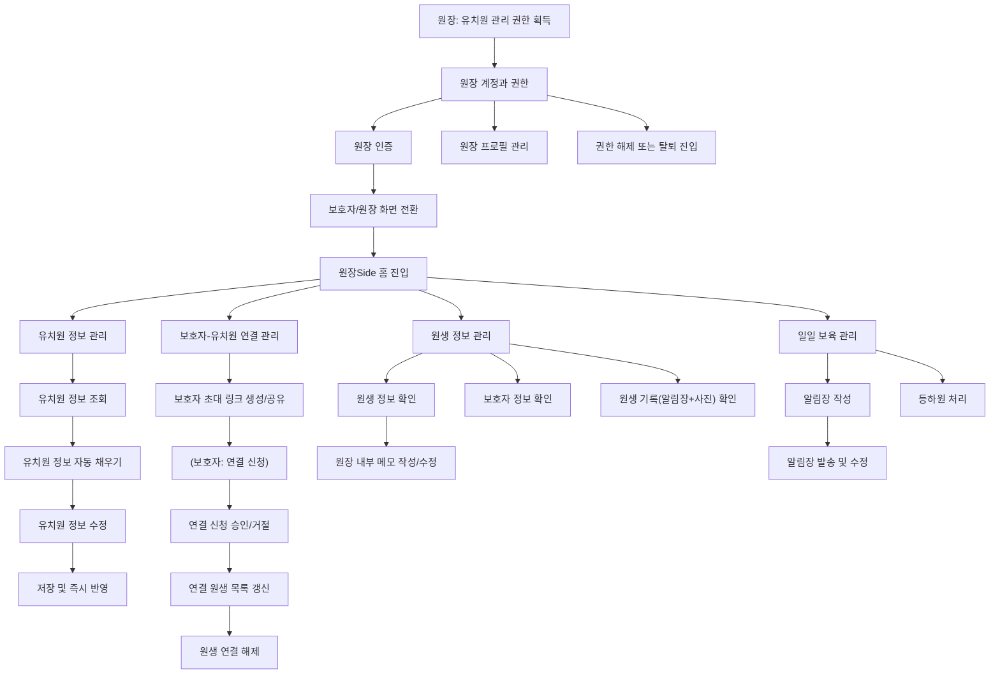

> 생성: 2026-07-28 16:00 · 최종 수정: 2026-09-02 12:35

# 서비스 개요

이 문서는 코드나 마이그레이션 설계 문서만 봐서는 알 수 없는 "이 서비스가 왜 존재하고, 지금 무엇을 하는 서비스인지"를 전달하기 위한 문서다. 도메인 작업(`docs/domains/*.md`)이나 아키텍처 문서를 보기 전에 먼저 읽는다.

## 1. 제품 정의

**똑독(knockdog) v3**는 반려견 유치원 원장과 보호자를 연결하는 B2B2C 운영 플랫폼이다.

- v2.0까지는 보호자가 반려견 유치원을 탐색·비교하는 서비스였다 (`kindergarten` 도메인 — 목록, 지도, 필터, 리뷰 등).
- v3.0은 여기에 "운영" 기능을 확장한다: 원장이 유치원 관리 권한을 얻어 원생을 관리하고, 등하원·알림장 같은 하루 생활 기록을 보호자에게 전달하는 최소 운영 루프를 만드는 것이 1차 MVP의 목표다. 결제·예약은 아직 범위 밖이다.

## 2. 이 서버의 계보

v1 → v2 → v3로 이어지면서 서버 자체도 바뀌고 있다.

- **v1/v2**: 레거시 Java 서버(`knockdog_server`, Spring Boot 3.1.1). 아키텍처·API 컨벤션·인증 흐름이 혼재된 상태로 누적되어 왔다.
- **v3(이 저장소, `daeng_v2_back`)**: Kotlin + 하이브리드 헥사고날 아키텍처로 재작성 중. 언어 전환과 동시에 도메인 경계(ArchUnit 강제)와 API 컨벤션을 다시 세운다.

무엇을 버리고, 무엇을 그대로 옮기고, 무엇을 다시 설계할지 논의한 당시의 결정 이력은 [`docs/adr/`](adr/) 폴더(`0001`~`0010`, 파일명이 일련번호순으로 정렬됨)에 있다. 이 문서는 "왜 지금 코틀린으로 마이그레이션하는가"의 요약만 담는다. 현재 엔드포인트 판정·도메인 제약·구현 상태는 관련 `inventory/`, `domains/`, `architecture/` 문서와 코드를 기준으로 확인한다.

## 3. 사용자와 역할

| 사용자 | 역할 | 1차 MVP에서 가능한 작업 |
|---|---|---|
| 원장 | 보호자 계정 상태에서 특정 유치원의 관리 권한을 획득한, 유치원 측 유일한 작업자 | 관리 권한 획득, 유치원 정보 수정, 보호자 초대, 연결 신청 승인/거절, 원생 조회/연결 해제, 등하원 처리/취소, 알림장 작성/발송 |
| 보호자 | 초대 링크로 유치원에 연결되고, 연결 이후 유치원 탭에서 생활 정보를 확인하는 사용자 | 프로필/반려견 프로필 작성·수정, 유치원 연결 신청, 연결 상태 확인, 등하원 알림 확인, 알림장 확인 |

## 4. 현재 MVP 범위

단계별로 범위를 나눠 진행 중이다. **지금 범위 밖인 기능(2차·3차)을 임의로 구현하지 않는다** — 요청 없이 결제·예약·이용권 로직을 추가하지 않는다.

| 단계 | 범위 | 상태 |
|---|---|---|
| 1차 MVP | 유치원 운영 기반, 초대/연결 관리, 원생·반려견 정보 관리, 등하원/출석 관리, 알림장, 알림, 보호자 유치원 경험 | 진행 중 (이 저장소가 다루는 범위) |
| 2차 MVP | 공지, 이용권 관리/예약 (서비스 내 결제 없이 타 경로 결제분에 이용권 부여) | 범위 밖 |
| 3차 MVP | 서비스 내 결제, 환불, 정산 | 범위 밖 |

1차 MVP 명시적 제외 항목: 선생님 계정/직원 권한 관리 (1차 MVP 이후로 연기).

## 5. 핵심 사용자 흐름

## 6. 도메인 용어집

| 용어 | 의미 |
|---|---|
| 원장 | 유치원 관리 권한을 획득한 사용자. 코드상 `owner` 도메인 |
| 보호자 | 반려견 소유자. 계정 기준으로는 `auth`/`user` 도메인의 일반 사용자와 동일 — "보호자"는 유치원과의 관계에서의 역할명 |
| 유치원 | `kindergarten` 도메인. v2에서는 탐색 대상, v3에서는 원장이 관리하는 운영 주체 |
| 원생 | 유치원에 연결된 반려견. 보호자의 반려견 프로필과는 별개로, 유치원 운영 기록의 기준이 되는 프로필을 갖는다 |
| 연결 | 초대 링크를 통한 보호자-유치원(원생 단위) 매칭. 자동 승인 또는 원장 수동 승인 대상으로 나뉜다 |
| 등하원 | 원장이 기록하는 원생의 등원/하원 상태. 처리 시 보호자에게 즉시 알림이 간다 |
| 알림장 | 원장이 하루 1회 원생별로 작성해 개별 발송하는 생활 기록. 발송 후 수정/삭제 불가 |

## 7. 참고

- 제품 요구사항 원본(PRD, 1차 MVP): [Notion](https://app.notion.com/p/PRD-1-MVP-37f6c15f67fb80128b2be2d7ae93101a?source=copy_link)
- Java → Kotlin 마이그레이션 결정 이력: [`docs/adr/`](adr/) 폴더
